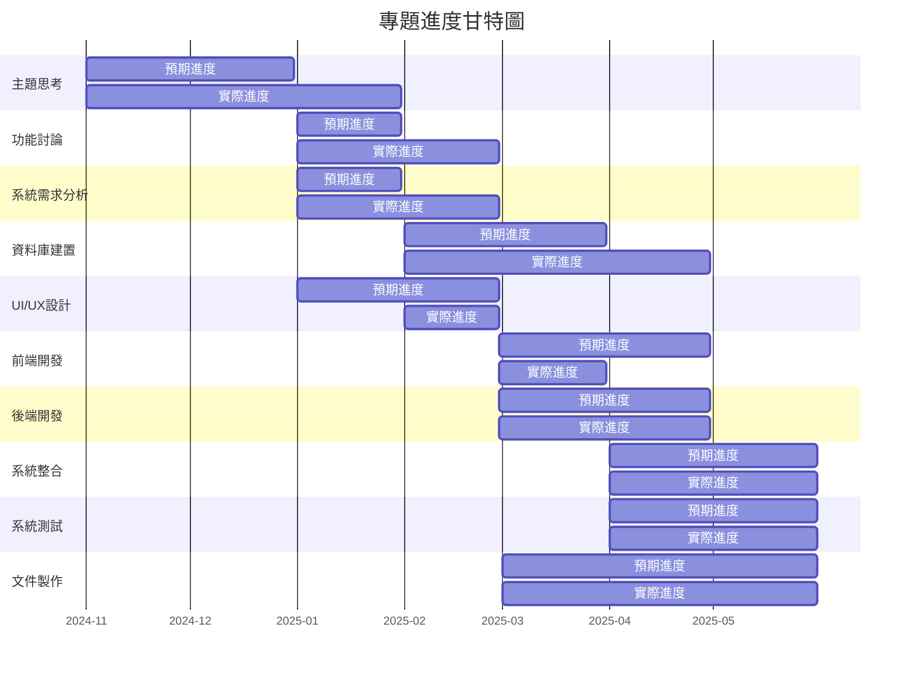

```mermaid
gantt
    title 專題進度甘特圖
    dateFormat  YYYY-MM-DD
    axisFormat  %Y-%m
    todayMarker off

    section 主題思考
    預期進度 :a1, 2024-11-01, 2024-12-31
    實際進度 :a2, 2024-11-01, 2025-01-31

    section 功能討論
    預期進度 :b1, 2025-01-01, 2025-01-31
    實際進度 :b2, 2025-01-01, 2025-02-28

    section 系統需求分析
    預期進度 :c1, 2025-01-01, 2025-01-31
    實際進度 :c2, 2025-01-01, 2025-02-28

    section 資料庫建置
    預期進度 :d1, 2025-02-01, 2025-03-31
    實際進度 :d2, 2025-02-01, 2025-04-30

    section UI/UX設計
    預期進度 :e1, 2025-01-01, 2025-02-28
    實際進度 :e2, 2025-02-01, 2025-02-28

    section 前端開發
    預期進度 :f1, 2025-02-28, 2025-04-30
    實際進度 :f2, 2025-02-28, 2025-03-31

    section 後端開發
    預期進度 :g1, 2025-02-28, 2025-04-30
    實際進度 :g2, 2025-02-28, 2025-04-30

    section 系統整合
    預期進度 :h1, 2025-04-01, 2025-05-31
    實際進度 :h2, 2025-04-01, 2025-05-31

    section 系統測試
    預期進度 :i1, 2025-04-01, 2025-05-31
    實際進度 :i2, 2025-04-01, 2025-05-31

    section 文件製作
    預期進度 :j1, 2025-03-01, 2025-05-31
    實際進度 :j2, 2025-03-01, 2025-05-31
```
